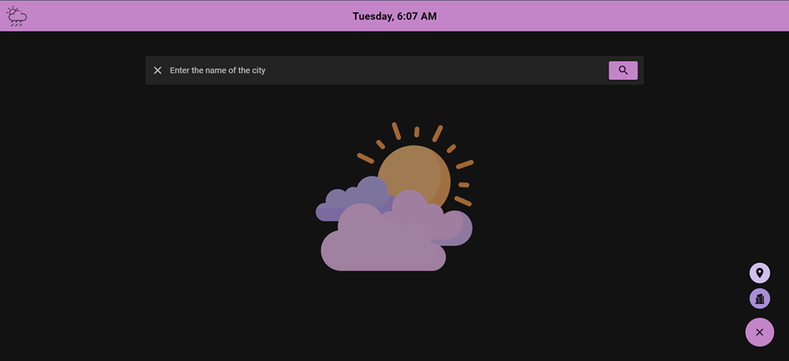
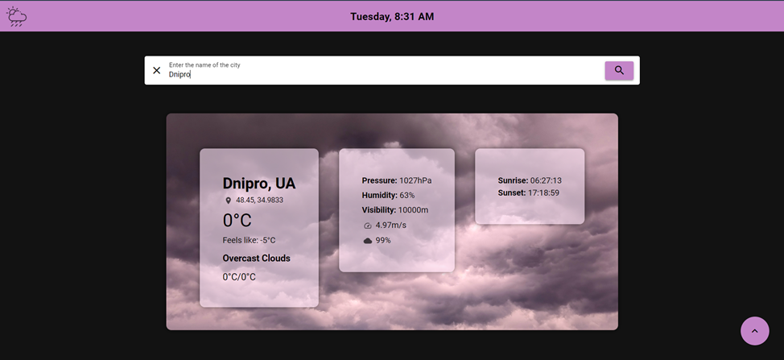
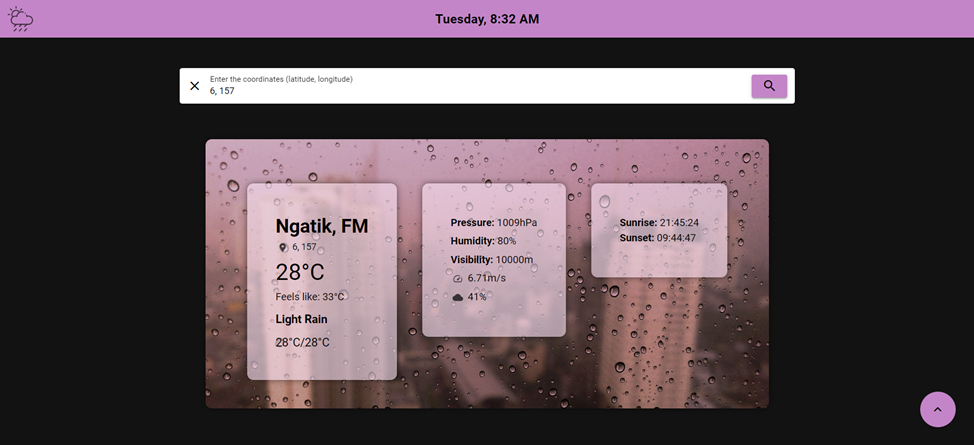

# Weather Monitoring Application

An information system for viewing current weather conditions in cities worldwide. The system operates as a web application and is available as a desktop client for Windows OS and a mobile application for Android devices.

## Key Features

- Fetching current weather data on demand.
- Weather data search by city name or geographic coordinates.
- Display of key weather parameters: temperature, humidity, wind speed, sunrise and sunset times, etc.
- Cross-platform support with consistent core functionality across web, desktop, and mobile environments.

## Tech Stack

- **Programming Language:** JavaScript
- **Frontend/UI:** Quasar (Vue.js)
- **Desktop:** Electron
- **Mobile:** Apache Cordova
- **API:** OpenWeatherMap (REST API, JSON)
- **CSS Preprocessor:** SCSS
- **Tools:** Node.js, npm, Quasar CLI, Android Studio

## System Architecture

- Quasar components for rendering the UI and displaying weather data.
- Asynchronous HTTP requests to the OpenWeatherMap API with JSON response handling.
- Vue Router for client-side page navigation within the SPA environment.

## User Interface

The application interface includes an input field for searching weather data by city name or coordinates, a floating action button for page navigation, and dynamic components displaying current weather parameters.

  
***Main Page***

  
***Weather Data Retrieval by City Name***

  
***Weather Data Retrieval by Coordinates***

## Getting Started

1. Clone the repository:  
	`git clone https://github.com/opyvonos/weather-app`
2. Configure the OpenWeatherMap API key:
	Replace `OPENWEATHERMAP_API_KEY` with a valid API key obtained from OpenWeatherMap in the following files:
	- `src/pages/IndexPage.vue`
	- `src/pages/PageCoords.vue`
3. Install project dependencies:  
	`npm install`
4. Launch the web application in development mode:  
	`quasar dev`
5. Build the desktop application (Windows):  
	`quasar build -m electron`
6. Build the mobile application (Android):  
	`npm install -g cordova`  
	`quasar mode add cordova`  
	`quasar build -m cordova -T android`  
	*Note:* Building for Android requires the **Java JDK** and **Android SDK** to be pre-installed.
