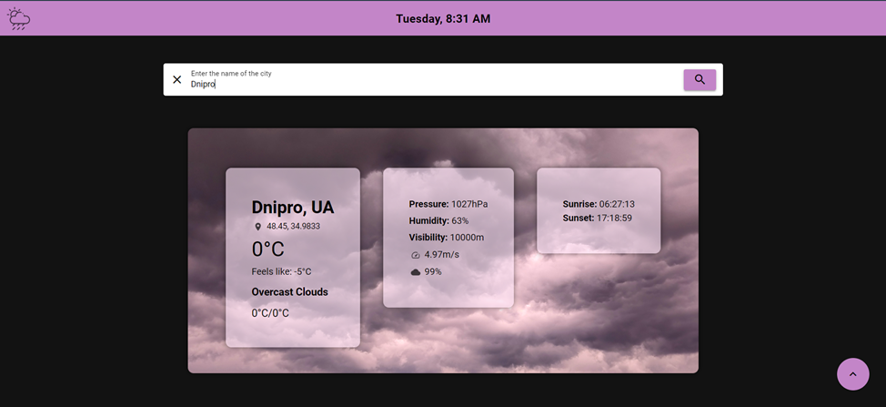

# Додаток для відображення стану погоди

Проєкт реалізує інформаційну систему для перегляду стану погоди у різних містах світу. Система працює як вебдодаток, а також доступна на персональних комп’ютерах під керуванням ОС Windows та мобільних пристроях Android.

## Функціональні можливості:

- перегляд погодних умов у реальному часі;
- пошук даних про погоду за назвою міста чи координатами;
- відображення основних погодних параметрів: температура, вологість, швидкість вітру, час сходу та заходу сонця тощо;
- кросплатформеність: забезпечення однакового функціоналу на всіх платформах.

## Використані технології

- **Мова програмування:** JavaScript
- **Фреймворки:** Quasar (Vue.js), Electron, Apache Cordova
- **API:** OpenWeatherMap
- **CSS-препроцесор**: SCSS
- **Інструменти:** Node.js, npm, Quasar CLI, Android Studio

## Структура системи

- Компоненти Quasar для відображення даних про погоду
- Формування запитів до OpenWeatherMap API та обробка відповідей
- Vue Router для навігації між сторінками

## Інтерфейс користувача

Інтерфейс додатка містить поле введення для пошуку за назвою міста або координатами, плаваючу кнопку для навігації між сторінками, а також відображення результатів з поточними показниками погоди.

  
***Головна сторінка***

  
***Отримання погодних даних за назвою міста***

  
***Отримання погодних даних за координатами***

## Запуск проєкту

1. Клонувати репозиторій:  
	`git clone https://github.com/opyvonos/weather-app`
2. Встановити залежності:  
	`npm install`
3. Запустити вебзастосунок:  
	`quasar dev`
4. Зібрати додаток для персонального комп'ютера:  
	`quasar build -m electron`
5. Зібрати додаток для мобільного пристрою Android:  
	`npm install -g cordova`  
	`quasar mode add cordova`  
	`quasar build -m cordova -T android`  
	Для збірки на Android потрібно додатково встановити **Java JDK** та **Android SDK**.